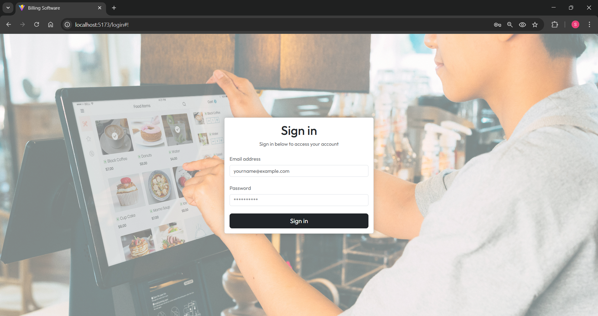
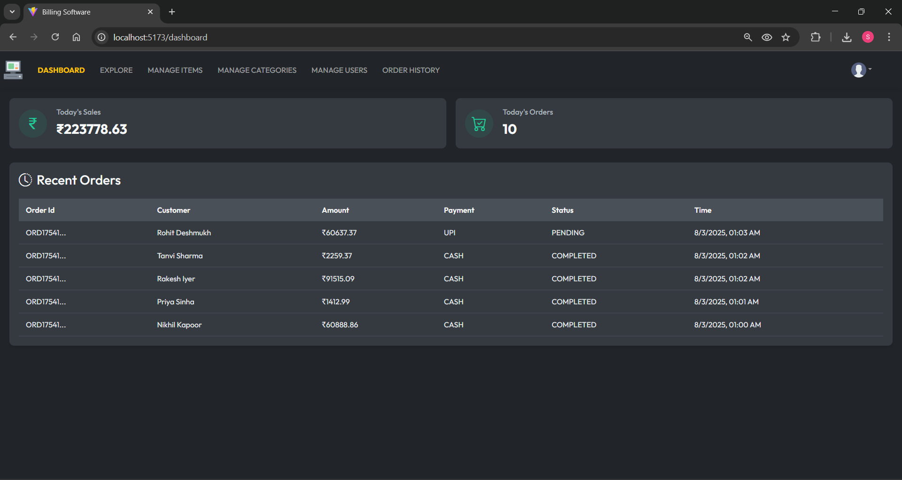
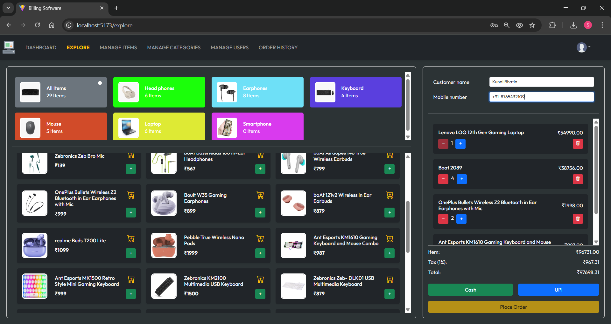
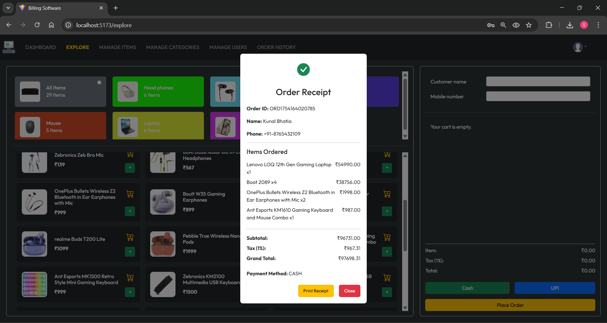
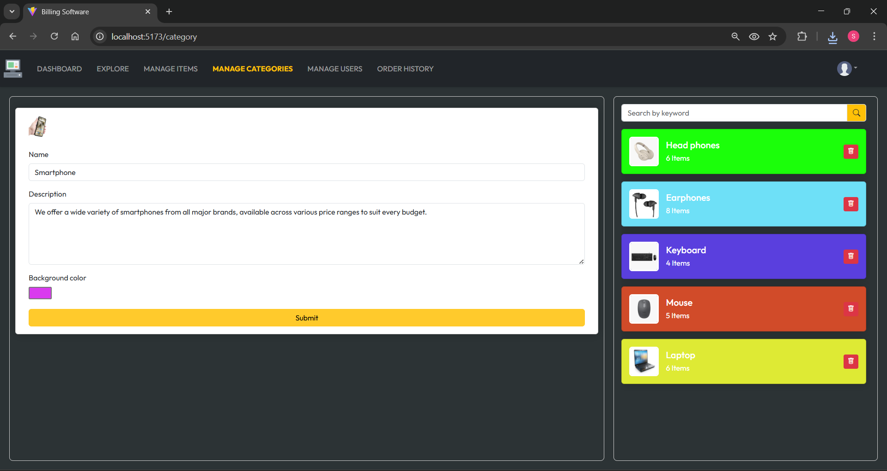
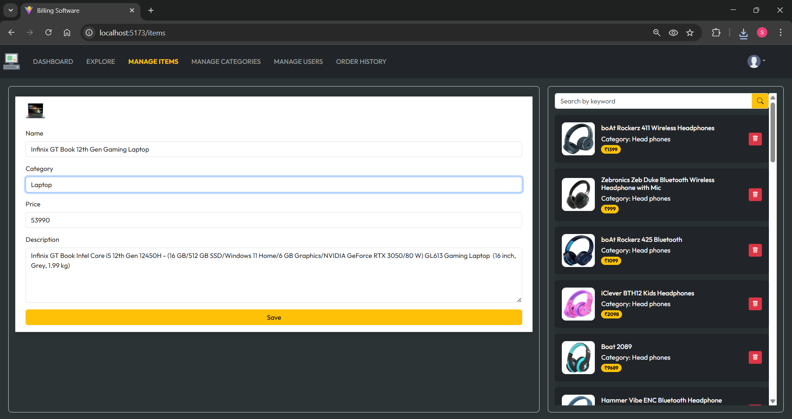
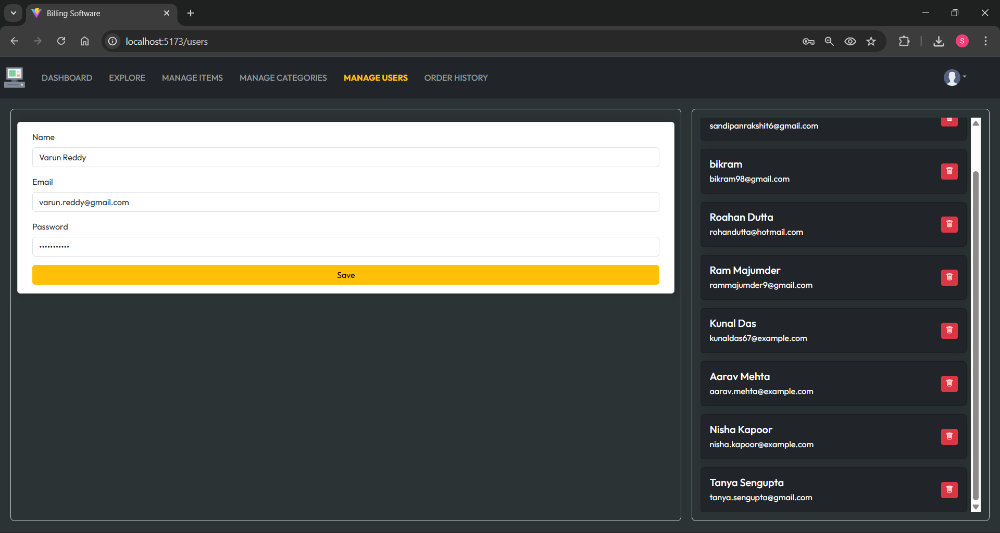
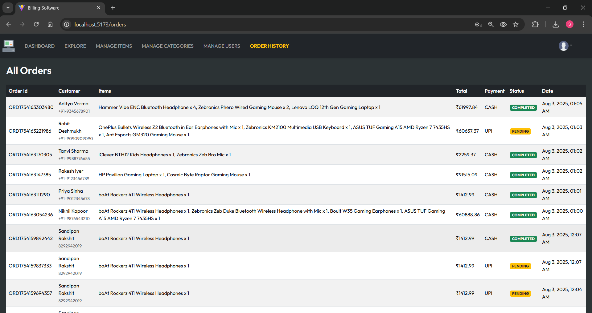

# 🧾 RetailPro: Full-Stack Billing & POS System for Retail Stores

A full-stack billing software solution built using **Spring Boot** for the **backend** and **React.js** with **Bootstrap** for the **frontend**. Designed specifically for small to mid-sized retail stores, it offers real-time **sales tracking, UPI payment integration via Razorpay, admin-controlled product and user management, and AWS integration for media storage**.

--- 

## 📌 Table of Contents
- [🧠 About the Project](#-about-the-project)
- [💡 Problem Statement](#-problem-statement)
- [✅ Features](#-features)
- [🛠️ Technologies Used](#-technologies-used)
- [🚀 Setup Instructions](#-setup-instructions)
- [🔐 AWS & Razorpay Integration](#-aws--razorpay-integration)
- [📸 Screenshots](#-screenshots)
- [✨ Unique Points](#-unique-points)
- [📬 Contact](#-contact)

---

## 🧠 About the Project

Retail Billing Software is a full-fledged billing system developed for a real-world retail client. It allows store admins and employees to:
- Add/manage products and categories
- Track sales in real-time
- Print order receipts
- Accept payments via UPI or Cash
- Maintain order history and statuses

---

## 💡 Problem Statement

Retail stores often struggle with manual billing, inventory tracking, and maintaining historical records. They need a digital solution that:
- Works in real-time
- Supports category-wise product listings
- Supports online & offline payment modes
- Enables easy invoice generation
- Allows central monitoring by store admins

---

## ✅ Features

### 1. 🔐 Login & Authentication

Secure login system for admin and employees.

<div align="center">  </div>

- Admins and users (employees) can log in using secure credentials.
- Access control is enforced using roles (ROLE_ADMIN and ROLE_USER).
- Admin dashboard provides full access to all management features.
- Users can only view and perform order-related operations as allowed.
- Unauthorized users are redirected appropriately to login or error pages.
- Passwords are securely hashed using BCrypt encryption.
- Option to encode new passwords using a dedicated API endpoint (/api/v1.0/encode).
---

### 2. 📊 Dashboard with Sales Insights

Shows total sales of the day in real-time.

<div align="center">  </div>

- Displays a list of recent orders with customer and payment details.
- Highlights pending orders that are yet to be fulfilled.
- Both admin and users can view the dashboard for operational updates.
- Admins get additional analytics such as number of users and total inventory.

---

### 3. 🛒 Explore Products & Place Orders

<div align="center">  </div>

- View all available products
- Filter by categories (Mouse, Keyboard, etc.)
- Search products by name
- Add to cart and checkout
- Cash/UPI payment options
- Automatically calculates tax and total

---

### 4. 🧾 Order Receipt Generation

Auto-generated order receipt on successful payment with print option.

<div align="center">  </div>

- Generates digital invoice after every successful order.
- Invoices include customer name, item details, prices, taxes, total amount, and payment mode.
- Razorpay API integration allows secure UPI payments directly from the app.
- Payment status is tracked and updated in real-time.
- Invoice PDFs/images can be printed or saved for customer reference.

---

### 5. 📂 Manage Categories (Admin Only)

Admin can create new product categories with a custom name and description.

<div align="center">  </div>

- Add / delete categories
- Assign background color, image, description
- Each category supports uploading a relevant image and background color.
- Helps in organizing the shop’s products in a structured way.
- Categories can be removed or updated as business needs evolve.
- Makes product filtering easier for both users and customers.
---

### 6. 📦 Manage Products (Admin Only)

Admins can add items under specific categories (e.g., keyboards from multiple brands).

<div align="center">  </div>

- Add / remove products under categories
- Set product image, price, description, and name
- Each product includes: image upload, name, description, and price.
- Items can be edited or removed anytime from the catalog.
- Inventory becomes visible instantly in the Explore section post addition.
- Great for scaling with large inventories without UI slowdown.
---

### 7. 👥 Manage Users (Admin Only)

Admin can add new employees with name, email, and password.

<div align="center">  </div>

- Add employees who can login and bill customers
- Delete inactive users
- Each user is assigned a role and saved securely in the database.
- Existing users can be deleted when no longer needed.
- Useful for branch-level operations where different users handle billing.
- Ensures only authorized personnel can access the POS interface.

---

### 8. 🧾 Order History

Admins and Users have access to a complete order history log.

<div align="center">  </div>


- View all past orders
- Includes customer name, phone, items, total, payment status & date
- Displays key information: order ID, customer name, phone, items, total bill.
- Tracks payment method (Cash/UPI) and payment status.
- Shows order timestamp and delivery/processing status.
- Useful for auditing, refund management, and sales reporting.
---

## 🛠️ Technologies Used

### 🔹 Frontend:
      - React.js
      - Bootstrap 5
      - Axios

### 🔹 Backend:
      - Spring Boot
      - JPA
      - MySQL
      - Maven

### 🔹 File Handling:
      - Local file system (for product/category image uploads)

### 🔹 Payments:
      - Razorpay (UPI integration)

### 🔹 Deployment:
      - AWS S3 (for media storage integration)

---

## 🚀 Setup Instructions

### 🧩 Backend Setup (Spring Boot)

1. Open the backend folder (billingsoftware) in IntelliJ IDEA or preferred IDE
2. Add your AWS & Razorpay keys in application.properties `application.properties`:
   ```properties
   aws.access.key= {YOUR_AWS_KEY}
   aws.secret.key= {YOUR_SECRET_KEY}
   aws.region= {ap-south-1}
   aws.bucket.name= {Your-bucket-name}
   razorpay.key= {YOUR_RAZORPAY_KEY}
   razorpay.secret= {YOUR_RAZORPAY_SECRET}
   ```
3. Create a database:
   ```
   CREATE DATABASE billing_app;
   ```
4. Start the Spring Boot app – tables will be auto-generated

5. Insert an Admin manually:
   ```
   INSERT INTO tbl_users(name, email, password, role, created_at, updated_at, user_id)
   VALUES(
     'yourname',
     'yourname@example.com',
     '$2a$10$Jv28cuVrSxzPsZeujtM8F.aqV7aSlUDu05GhYzG/cbd1gtTNurQRe',  -- password: 123456
     'ROLE_ADMIN',
     current_timestamp(),
     current_timestamp(),
     uuid()
   );
   ```

6. To create custom passwords, use:
   ```
   http://localhost:8080/api/v1.0/encode
   ```
   
### 🧩 Frontend Setup (React)

1. Open client folder in VS Code
2. Update constants.js with your Razorpay key
3. Run the React app:
   ```properties
   npm install
   npm install --save-dev ajv@^7
   npm run dev
   ```
## 🔐 AWS & Razorpay Integration
- AWS S3 is used to store images for products & categories
- Razorpay is used for online UPI-based payment collection
- Payment status is reflected in dashboard/order history

## ✨ Unique Points
- Real-time order management and sales tracking
- AWS integration for image upload and access
- Razorpay UPI support
- Clean UI with Bootstrap & responsive layout
- Admin/user role-based access
- All actions backed by RESTful APIs

## 📬 Contact
For setup issues or business inquiries:

📧 Email: sandipanrakshit6@gmail.com
